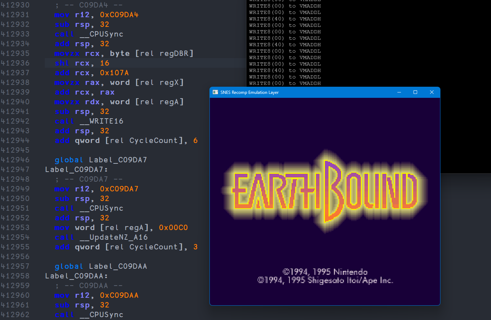

# SNESRecomp
  

**SNESRecomp** is an experimental project that recompiles execution traces from a SNES emulator into x86_64 code, then runs them through a lightweight emulation layer.

The goal is to explore static/assisted recompilation for SNES software while keeping behavior as accurate as possible.

## Components
`emu.cc` - *Emulation layer.*

Provides basic hardware abstractions 
Manages CPU state and memory access 
Acts as the runtime environment for the recompiled code.  
Uses `snes.h`

`recomp.cc` - *Main SNES recompiler.*

Reads traces generated by a specially-instrumented emulator 
Translates SNES instructions to host code 

## Screenshot

Here is a screenshot of Earthbound alongside part of the generated assembly:

## Status
The SPC700 is currently not emulated so not audio. In order to make games
work, it is necessary to short-circuit routines that communicates with audio.

The project is currently very experimental. The goal was to explore a new
way to recompile games into *x86_64* assembly.